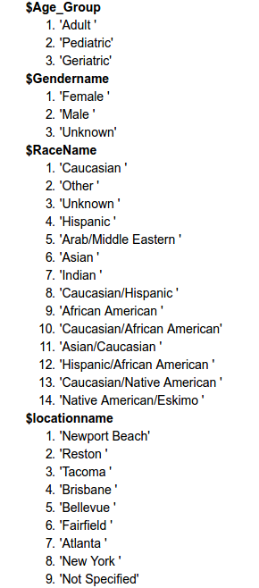
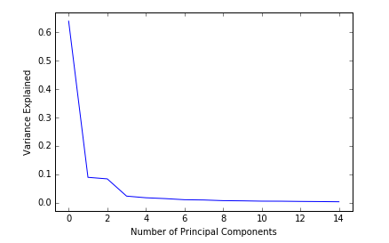

## Progress Report - March 22nd, 2016
**Table of Contents:**
- [Overview](./progress_report.md#overview)
- [Scientific Questioning](./progress_report.md#scientific-questioning)
  - [Decriptive Analysis](./progress_report.md#descriptive-analysis)
  - [Exploratory Analysis](./progress_report.md#exploratory-analysis)
  - [Inferential Analysis](./progress_report.md#inferential-analysis)
  - [Predictive Analysis](./progress_report.md#predictive-analysis)
  - [Testing Assumptions](./progress_report.md#testing-assumptions)
  - [Next Steps](./progress_report.md#next-steps)
- [Methods](./progress_report.md#methods)
  - [Decriptive Analysis](./progress_report.md#descriptive-analysis-1)
  - [Exploratory Analysis](./progress_report.md#exploratory-analysis-1)
  - [Inferential Analysis](./progress_report.md#inferential-analysis-1)
  - [Predictive Analysis](./progress_report.md#predictive-analysis-1)
  - [Testing Assumptions](./progress_report.md#testing-assumptions-1)

----------

### Overview

### Scientific Questioning

#### Descriptive Analysis
Our dataset consisted of approximately 7500 patient records and 754 features. However many patient records had missing or incomplete data. Once we dropped missing data and NaNs, our data was reduced to 2794 patient records. The features in the patient feature vectors can be broadly classified into 4 categories.
1. Patient Info
2. Disorder data
3. Survey Responses
3. RCBF values

#### Exploratory Analysis

Our initial exploratory analysis consisted of just determining standard statistical values of different columns like the mean, max and min to see if there any obvious red flags. We also wanted to know the answers to questions that define significant populations in our data, like who are "healthy" people and just how many of them are there or who are the different types of people who participated in this study. 

We found that there just about 50 healthy people out of the 7500 people who participated in the study. This is what we found 

Once this was complete we carried out more detailed exploratory analysis using K Means clustering and Principal Component Analysis. 
Our expeiments with K Means Clustering did not yield any conclusive results. Clustering with all the features made the distribution far too noisy. The silver lining however was that a few outlier were readily identified. 
 

To reduce the dimensionality we employed PCA. This led us to belive that most of the variance can be explained by 27 features, 14 by the first principal component, 14 by the second. This reduced dimensionality would greatly improve the ease with which we can perform rigorous Inferential and Predictive Analysis.

#### Inferential Analysis

#### Predictive Analysis

| Classifier | Accuracy | Standard Deviation |
|------------|----------|--------------------|
|Logistic Regression | 0.9653 | +/- 0.183 |
|K Nearest Neighbors | 0.5594 | +/- 0.496 |
|Support Vector Machine| 0.4882 | +/- 0.500 |
|Random Forest| 0.9649| +/- 0.184 |
|Quadratic Discriminant Analysis| 0.9624 | +/- 0.190|

#### Testing Assumptions
The notion of independence of sampling for a dataset such as ours is a bit kludgy. Samples might not be independent if they have similar RCBF patterns or have similar disease profiles. Therefore in a set of mixed but reduced features we could reliably determene sample independence by examining the rows of the matrix formed by patient record.

By random sampling 27 patiensts around 1000 times and examining the rank of the matrix we can determine how many samples are not linearly independent of another sample. This can achieved by examining the rank of the matrix.

We found that less than 5% of our samples were not sampled independently.

#### Next Steps

### Methods

| Question Type | Code |
|---------------|------|
| Descriptive | [**``Descriptive_Exploratory_Answers.ipynb``**](https://github.com/Upward-Spiral-Science/spect-team/tree/master/Code/Assignment-3) |
| Exploratory | [**``Descriptive_Exploratory_Answers.ipynb``**](https://github.com/Upward-Spiral-Science/spect-team/tree/master/Code/Assignment-3) [**``Exploratory_Kmeans_PCA.ipynb``**](https://github.com/Upward-Spiral-Science/spect-team/blob/master/Code/Assignment-3/Exploratory_Kmeans_PCA.ipynb)  |
| Inferential | [**``Inferential_Depressed.ipynb``**](https://github.com/Upward-Spiral-Science/spect-team/blob/master/Code/Assignment-4/Inferential_Depressed.ipynb) |
| Predictive  | [**``PCA.ipynb``**](https://github.com/Upward-Spiral-Science/spect-team/blob/master/Code/Assignment-5/PCA.ipynb)  [**``Classification_Simulation.ipynb``**](https://github.com/Upward-Spiral-Science/spect-team/blob/master/Code/Assignment-5/Classification_Simulation.ipynb) | 
| Testing Assumptions | [**``test_assumptions.ipynb``**](https://github.com/Upward-Spiral-Science/spect-team/blob/master/Code/Assignment-6/test_assumptions.ipynb) |

#### Descriptive Analysis
While answering Descriptive questions we were primarily trying to find out more about what our data even is. Since there were so many features and and so many clobbered patient records we had to clean our data before we started answering these questions. Once our data was cleaned and in the shape we need it to be we carried out basic exploratory analysis
#### Exploratory Analysis
Our exploratory analysis consisted of answering basic statistical questions about our data, this was invaluable in deciding what tests to use on our data and what paths to not explore when carrying out inferential and predictive analysis. Or exploratory analysis also aimed to simplt the nature of data as to make more advanced analysis less tedious.

#### Inferential Analysis

#### Predictive Analysis

#### Testing Assumptions

       Depressed BIC       |     Not Depressed BIC
:-------------------------:|:-------------------------:
 | 

